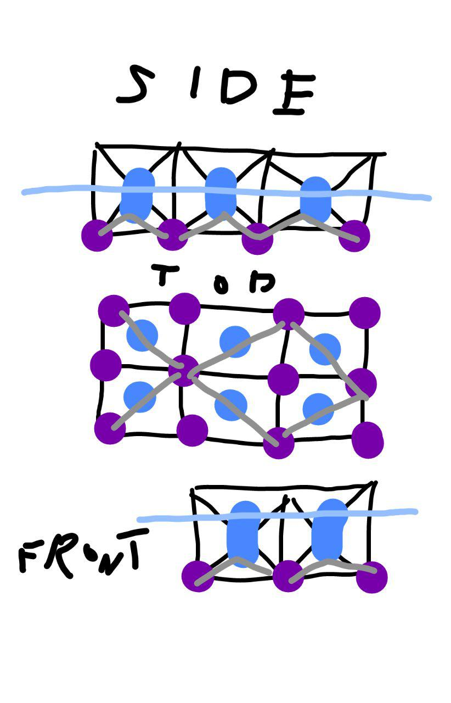

# Проблемы

## Плавучесть.

Надо нести не малую полезную нагрузку. ну вроде всё просто - больше полостей с воздухом. Особых вариантов не видно.
Стандартный 40-футовый iso-контейнер это около тонны на квадратный метр при полной загрузке.

## захлёстывание волной

Платформа должна быть поднята над уровнем воды минимум сантиметров на 50, чтобы каждая волна не захлёстывала.
Варианты:
1. делать емкости и держать их пустыми 50 сантиметров - непозволительная роскошь.
2. выносить на фермах - пространство между жилой платформой и поплавками будет зарастать. его неудобно чистить.
фермы надо из чего-то делать, чтобы не портилось и держало нагрузку, но само не тратило полезный вес.
это поднимает центр масс сильно.
3. Можнно просто сделать стены по периметру, но их будет ломать волнами.

## Проблема устойчивости на наклонном грунте
Актуальна, если конструкция будет контактировать с сушей
Нужны какие-то опоры и защита от ударных нагрузок
Есть вариант - использовать наклонные опоры.

## Конструкционная жесткасть.

Усточивость к боковым ударам с другими модулями. Перераспределение точечных нагрузок.

## Обрастание

Ракушки, водоросли, черви - все это за месяц в условиях карибского бассейна может вырасти на 5-7 сантиметров. тоесть за пол года нарастёт почти 30
Поддаются механической чистке. Почти не изменяет плавучесть, если растёт не там где должны быть воздушный пузыри. Сильно увеличивает трение об воду (возможно это плюс).
Есть специальные препараты для защиты разной степени экологичности, но для эффективности они должны вымываться из материала и создавать раствор вокруг поверхности. это значит периодическую обработку (с вытаскиванием на поверхность).
Если нет активной циркуляции воды рядом с обработанной поверхностью, то пропитки хватит на дольше.
Не обрастает резина и листовое стекло.

Возможно делать модульную защиту под водой и просто менять её, но она должна достаточно плотно прилегать к защищаемому и почти не иметь щелей.


## Подтекание буйков

### Отказ от буйков

Тупо кесоны, куда нагнетается воздух.

Минусы:
* При сильной качке теряют плавучесть за счёт сильной утери воздуха.
* Требуют постоянной подпитки воздухом.

### Трубки для откачки воды и нагнетания воздуха

В каждый поплавок по ниппелю для закачки воздуха внутрь.
И расходомеры на насосной станции знают примерное значение утечки на каждом буе.

Минусы:
 * сложная инфраструктура

### Датчики протечки

Плюсы:
* Можно унифицировать и сделать один дешевый стандартный датчик, который применять во всех буйках и не только.
* Почти не требует инфраструктуры

Минусы:
* Требуется смена батареек, что в качественном буе долгосрочноно применения не просто.

### Визуальный осмотр

Годится для небольших количеств буйков при их открытом размещении

### Детектирование через крен платформы

Имхо очень плохой вариант. Можно узнать очень поздно. Если буйков много и подтекают равномерно, то крена не будет. Перегруз края платформы тоже даст крен - ложные срабатывания.

# Варианты конструкции:

## Классическая нефтяная платформа

Плюсы: проверено тысячекратно. устойчива в самый сильный шторм. готовая инфраструктура.
Минусы: дорого. избыточно. не масштабируемо. лишена прелестей "домика у воды". неизвестно как со стыковкой с другими платформами

## Крупный модуль модели "ковбойская шляпа"

Единый купол. широкие подводные поля для устойчивости

Плюсы: Возможно использование подкупольного пространства.(?) возможно использование полей шляпы.(?) очень устойчиво.
Минус: постоянная подпитка воздухом. однокамерность - нет отказоустойчивости.


## Модуль модели "цельнолитые пчелиные соты"

Материал либо бетон либо другие композиты.
Плюсы: дешево и долговечно.
Минус: низкая плавучесть.
годится вероятно на волноломы и общественные дороги.
в шторм можно затапливать

## Модель "бетонная плита поверх буйков"

Вероятно бетонная плита, как конструкционная основа для всего.
Пока есть такой вариант:

```
    # - бетон
    O - буйки из стекловолокна или пластика
    _ - композитный настил
    ~ - море
    8 - какая-то относительно тонка легко сменная конструкция из например бамбуковых ячеек. для защиты от физических повреждений и как сменная поверхность для обрастания
       _________________________________
       #удобрения,вода##горючка, септик#
    ~~~#################################~~~~
    ~~8#OOOOOOOOOOOOOOOOOOOOOOOOOOOOOOO#8~~~
    ~~~888888888888888888888888888888888~~~~
    ~~~~~~~~~~~~~~~~~~~~~~~~~~~~~~~~~~~~~~~~
```

Плюсы: Есть главна несущая плита, которая обеспечивает перераспределение нагрузок, боковую жесткость.
Относительно низкий центр тяжести
очень простая конструкция в воде - никаких креплений, которые могут ржаветь. повреждение одного ни на что не влияет - их под сотню.
По идее высокая долговечность без ухода.
Минусы:
не приспособлено для посадки на сушу.
непонятен пока механизм строительства

## Модель "бетонные сферы, покрышки, бетонная плита"

плюсы:
* следущий по цене способ обеспечения плавучести после пластиковых бочек
* более стоек к истиранию\трещинам от перегибов
* нет надобности строить отдельную ферму
* легко буксировать
* в пределах того что может установить 1 человек
* наиболее рациональное использование бетона за счет формы и давления
* можно использовать как якорь наполнив песком
* можно изготовить почти где угодно в мире на месте

минусы:
* значительно более слабая конструкция чем фермы или бетонные блоки когда расчитывается нагрузка больше чем на 1 модуль
* так же требует очистку и проверку раз в год, но ее сложно провести из-за веса модуля
регуляция плавучести только заполнением водой

## Модель "решетчатая ферма с бочкамии"


Плюсы: просто в обслуживании. Доступно одному человеку.

Проблемы которые этот вариарт решает:
* осадка на грунт (вертикальные опоры)
* наклонный грунт (диагональные опоры)
* дешевая плавучесть (бочки)
* прочность платформы (за счет большего рычага)
* контроль высоты (натяжением каната бочки)
* центр тяжести (груз на нижнем уровне для посадки)
* захлест волной (бочки ниже, платформа выше)
* сборка одним человеком(элементы в пределах 20 кг)
* замена бочек плавучести одним человеком(меж диагоналей)
* изменение крена одним человеком (веревка бочки)
* починка\очистка структуры одним человеком (поднять из воды)
* спуск на воду одним человеком(сотни кг)
* большой запас плавучести (4\6 пробитых - не утонет)
* буксировка (лучше плоскостенных модулей)
* стандартизация надводной и подводной структуры


проблемы которые он создает:
* раз в год нужно провести осмотр\починку\чистку
* поднятие и очистка от ракушек. (сбор как ресурсы?)
* обновление слоя защиты ферм, оцинковка\краска
* проверка бочек и канатов на истирание\трещины

## Модель "стакан"

Сабж понятен из названия. Грубо говоря бетонный цилиндр, верхние пару метров выступают из воды, остальное - под водой.
Возможный вариан - модель "перевернутая ковбойская шляпа" или совмещение с моделью "бетонная плита с буйками"

Плюсы:
* малая подверженность волнению.
* позволяет компактно расположить производство.
* очень простая конструкция в плане ухода и взаимодействия с морской средой.
* можно рассеивать жаркое тропическое солнце на большой объем
* в отличии от плоских платформ допустим построить что-то протяженное в высоту без потери устойчивости
* не требует дорогих буйков

Минус:
* давление на глубине даже нескольких метров для полой конструкции - существенная нагрузка
* рассеивать свет - допустим. Но идеальное рассеивание для той же картошки - около 1\10. Это можно обеспечить и в паре этажей теплицы (поставив 10 ярусов с кустами) но рассеивание замедляет рост. Т.е. дешевле растить чуть менее эффективно но на более дешевом поле. солнце дешево
* буйки - да. Но нужен балласт. Много балласта. т.е. дно должно составлять порядка трети от веса всей конструкции чтобы не переворачивался стакан
* промышленность - требует связей. стакан-поверхность-стакан  = слишком дорогой переход для промышленности
* не подходит для мелководья

# Материалы

надо напихать как минимум плотности, прочности на разрыв, сжатие, изгиб

## Бетон

* Вероятно оптимально базальтовая арматура + добавление базальтовой фибры
* Базальтовая арматура дешевле стальной и легче. Не корродирует в солёной воде.
* Добавление базальтовой фибры увеличивает показатели прочности на разрыв, химической стойкой, ударной вязкости в разы.
* Повышение цены порядка 10-50% (в зависимости от количества фибры и её марки).
* частично можно изготавливать на месте в перспективе.
* Стеклофибра должна содержать 16%+ циркония (металл со стоимостью около 100 $/kg), иначе волокна распадуться без прочности атакованные бетоном, называется AR-glass
* оптимальное количество фибры: 0.3% обьема по цене, 1% обьема по прочности на разрыв, 2% обьема по арочности на удар
* Пластиковая фибра обладвет почти теми же свойствами что и AR-glass фибра но дешевле.
* в оптимальном случае прочность цемента на разрыв выростает в 5 раз, прочность на сжатие в 2 раза при использовании фибры
* следущий технологический уровень - текстилебетон. получается вдавливарием бетона в очень толстую и пористую ткань с большими ячейками с волокнами повернутыми перпендикулярно

* Обычный железобетон слишком тяжел и хрупок. и из него можно изготавливать только очень большие конструкции с линейными размерами в десятки метров.

## Бамбук

Главный бонус - растёт на месте. Из него можно делать сменные части. Например внутренние каркасы для поплавков из пресованного бамбука.

## Дерево

Дешевые сорта дерева гниют в воде, гораздо сильнее обрастают всякой живностью. Хорошо применимо там где нет пребывания в воде.

## Пластик

## Стекловолокно

## Алюминий

Можно делать буйки.
Плюсы:
* высокое соотношение массы к прочности.
* Хорошая антикоррозионная стойкость.
Минусы:
* Цена


# Форма

Сиастендинг провели конкурс разных вариантов и взвесив все за и против остановились на сочетании шестиугольник и квадрат со стандартным размером стороны
Предлагаю не выдумывать сущности там где нет необходимости

## Квадрат


## Шестигранник

## Производные квадрата

## Круг

Плюсы:
* удобно лавировать среди других островов.
* для модели "плавающий стакан" удобное распределение нагрузки

Минусы:
* 10% открытой воды из-за которых неудобно мостить большое пространство. впрочем возможно просто делать что-то типа съемных крышек
* мир квадратный и не эффективно используется круглая площадь.
* неудобно на старте делать круглые фермы вероятно.

# Размер стандартного модуля

Предлагаю плясать от стандартного ISO-контейнера.
Во-первых их используют везде на море и можно использовать контейнеры как дешевые варианты жилья/склада.
Во-вторых удобно получать товары с суши - там загрузили контейнер, а тут его сухогруз снял и сразу поставил на платформу.
В-третьих возможно получится предоставлять услуги перевалочного хранения контейнеров (хотя понадобятся отдельные грузовые модули).

## ISO контейнер
длина - 6.058м (или 12.192 метра для двойного контейнера) (это 80% контейнеров. есть другие варианты длины, но они мало популярны)
ширина - 2.438м
максимальная нагрузка - 30.5 тонн не зависимо от длины контейнера. собственный вес - 2-3 тонны.
тоесть при длинном контейнере мы получаем около 1026кг на квадратный метр, тоесть в принципе достижимая плавучесть.

## предлагаемые варианты размера сторон

### 12.2 метра.

тогда на стандртный квадрат встаёт 4 контейнера и остаются большие неиспользуемые площади.
но если делать прямоугольные модули кратной длины, то легко масштабируется, а малые отдельные модули всё равно плохо годятся под нужды чисто портовые.
если под строительство, то получаем не маленькую площадь в почти 150 метров.
стоимость материалов в варианте "бетонная плита на буйках" получается около 2 миллионов рублей (основная стоимость - пластиковые емкости)
у шестиугоульника с такой стороной получается около 380м2 - можно уже строить общественные помещения приличные.


### 10 метров

на квадрат влезают только 20-футовые контейнеры и очень не эффективно. при прямоугольных модулях такой ширины влезают 4 контейнера по ширине.
на шестиугольник влезают 4 контейнера 40футовых и один 20-футовый.
площадь получается 100 и 260 метров соответственно. в полтора раза дешевле и ниже уровень входа.
из минусов - в далеком и светлом будущем это конечно станет нехватать и сразу начнут процветать кратные модули. так может таки сразу делать больше?

### 6.1 метра

бюджетный вариант возможно для старта. никаких шестиугольников - только как уполовиненая версия 12.2 сразу в расчёте на объединения в квадраты 12.2*12.2


# Соединение платформ

Зависит от выбранной модели платформ

## Канатная сцепка + буфера-покрышки

## жесткая механическая сцепка

## отсутствие сцепки как таковой.

Странный вариант. Делать по сути не стыкуемые платформы.
Они будут отдельно-плавающие и могут соеденяться подвесными мостами, понтонными мостами,просто на лодках в гости плавать.
Вероятно под водой можно пустить свободно висящие кабели и мягкие трубы.
Плюсы: идилия уединения. Торжество индивидуализма. Свобода лавирования и перемещения.
Минусы: сложность логистики по воде. Сцепки устойчивее в шторм.
На практике скорее всего сгодится только для очень малочисленных общин или при очень больших модулях.


# Подвижность, сцепление с грунтом и др.

## Свободно плавающие конструкции
Очевидно, не очень подходящий вариант, т.к. рано или поздно течениями или ветрами будет унесено в нежелательном направлении или прибьётся к берегу. 
Плюсы - отсутствуют многие сильно утяжеляющие конструкцию элементы (якоря, мачты, двигатели, топливо, рули и т.п.)

## Постоянно прикреплённые к дну конструкции или ограниченно подвижные
Якоря и тросы. Конструкция средней тяжести, тяжелее первого варианта, легче следующих. Чем больше поселение, тем большее количество и масса якорей будут требоваться. Варианты: 1) стояночные многоразовые якоря (требуется устройство для подъёма/спуска якоря), соответственно, подразумевается некоторая подвижность всей конструкции и возможность переплыть на другое место стоянки, 2) т.н. мёртвые якоря, которые сбрасываются один раз и надолго, при необходимости переместиться они выбрасываются совсем и остаются на дне.

## Подвижные плавучие конструкции
Для постоянной возможности передвигаться требуются двигатели + топливо (или как вариант - солнечные батареи, которые скорее всего будут использоваться во всём этом действе вообще много где). Возможный вариант - паруса, но кто с ними умеет обращаться?
Якоря для этого варианта также нужны, то есть конструкция утяжеляется ещё больше.
Плюсы - в любой момент времени можно передвинуться куда угодно по желанию жителей, повышается общая "живучесть" всего острова на случай если его куда-то унесёт, что-то произойдёт и т.д.
Минусы - имхо плавающая бесформенная куча бочек тут уже не подходит, нужна некоторая форма с носом, кормой и всеми другими атрибутами нормально плавающего средства. Не обязательно прям обтекаемая форма корабля, пусть и квадратная или круглая, но в любом случае двигатели и рули должны быть в каком-то определённом месте.

Возможно, подходящие варианты - переходные формы между платформами и кораблями. 
К примеру, гуглить: широкие и низкие мониторы береговой обороны, круглые броненосцы типа "Поповка" и т.п.
Недостатки упомянутых кораблей в сравнении с привычными суднами - плохая мореходность, захлёстываются волнами, но большинство недостатков были из-за того, что они несли на себе толстую броню и массу орудий/башен/снарядов. 
При применении современных материалов и "скиллов" при постройке проблемы должны заметно уменьшиться.
